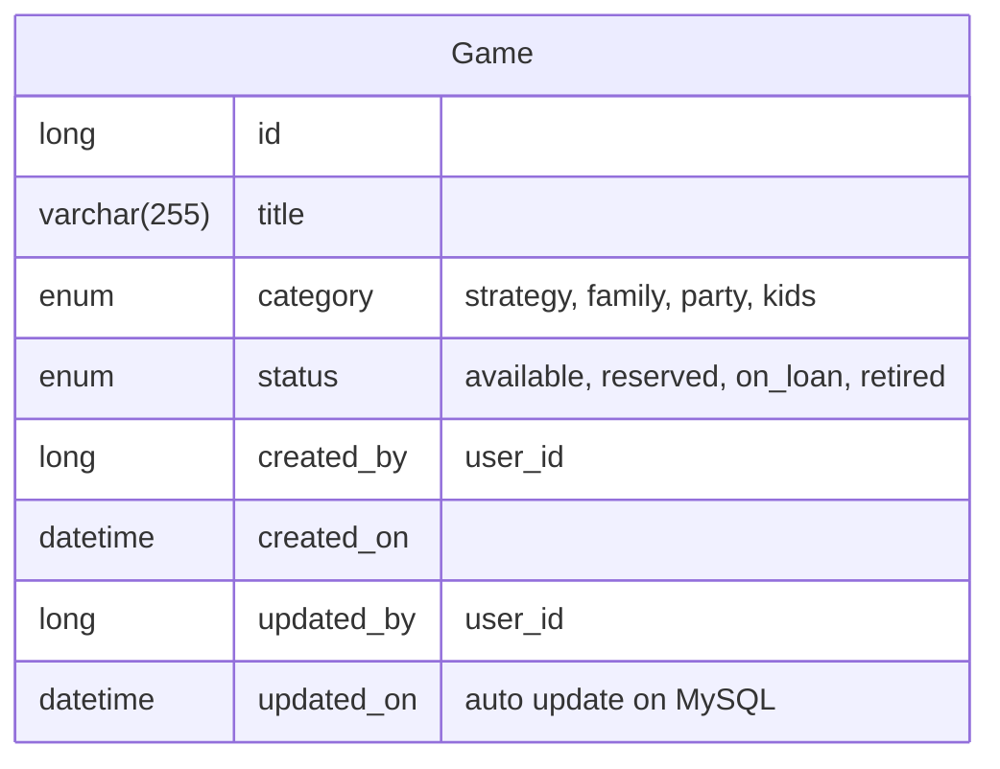

Arthur: W Cheng\
Development Environment: WSL - Ubuntu 24.04.4 LTS\
AI Assistant: Claude Code\
Tools: VsCode\
Setup Developlment Environment: Completed at 2026-07-21 15:04 BST\
GitHub token works.\

## Running the full stack (demo)

There's a root-level `compose.yaml` that `include`s both `backend/compose.yaml` and `frontend/compose.yaml`, so the whole stack (Laravel + MySQL + React/Vite) can be started with one command from the repo root:

```bash
docker compose up --build
```

- `.env` at the repo root is a symlink to `backend/.env`, so plain `docker compose` (which only auto-loads a `.env` from the directory it's run in) still picks up the same DB/app config Sail uses.
- `WWWUSER`/`WWWGROUP` default to `1000` in `backend/compose.yaml` so the container's file ownership matches a typical single-user Linux/WSL setup without needing `./vendor/bin/sail`'s auto-export. Override them (`WWWUSER=$(id -u) WWWGROUP=$(id -g) docker compose up --build`) if your host user isn't UID/GID 1000.
- Frontend: http://localhost:5175
- Backend: http://localhost:8080

For day-to-day backend-only development, `./vendor/bin/sail up` from `backend/` still works as normal (see `backend/compose.yaml`) — just don't run both stacks at once, since they'd fight over the same ports (8080, 3306, 5173).

## Note after Complete the tasked

It has been a pleasure to deliver this project in a timely manner. It's been a challenge as it is my first project encountering Laravel, which took a bit more time than I guessed for setup. The AI Agent setup everything on its own is quite an eye-opner for me.
I found a lot of practice used in Laravel Framework is similar to what SpringBoot Framework have been offering, like Eloquent is similar to Hibernate, where it is an ORM that helps to handle query. It is parameterized when used with criteria builder, which is exactly how Hibernate been behaving.

There is some shortcoming of this project that, due to time constraint, I cannot fully realize authorization part. When the requirement indicated `Library Volunteer` is different then `Customer`, and `Library Admin` should have the highest authority. The current state is susceptible to anyone with access to the system itself.
It is sad that I cannot implement a Login Page in time.

In contrast, I took the liberty to enhance a bit on the requirement provided. For example, the server allows query by Game's title, and there is visual cue to what Status the Game can be changed. When a game is retired, the frontend dropdown list is disabled, further indicating the intention to the user.
Obviously, the backend do validate such request in case of unintended user request by means of `curl` or `Postman`.

For the audit trail part, I found it weird that the `created_by` and `updated_by` is not mentioned in the requirement. I added it in case the authorization is implemented, the user created or updated  the record can be traced.

One of the weird property of "retired" I find is, it will allow multiple instance of "Game" with same name, some are in "Retired", while other are "Available". Which is allowed in this project for now unless further comment is added.

## Note

This README is the inital draft on how to progress on this task, will be trasnfer to `docs/inital thought` later in the repository.

## Inital Thought

Task: Develop a community board-game lending library.

Feature 1:  Create frontend page in `React`, allow browsing and filter the collection.

Feature 2: Create a button as `Add Collection`, create a form for adding a collection.

Feature 3: Allow transition of collection's `lifeCycle`

Feature 4: Special case of `lifeCycle`, `retired` (Retired mean **lost** or **damaged**). (When `Game` is retired, status no longer can be `available`.)

### Database Spec




## Initial Caution thought

1. Probably no login for now? There is no requirement for authencation yet, tho should left room for adding such function later.
2. Database using enum... is efficient, but will there be modification on `status` enum?
3. For feature 4, What does it mean a replacement copy can be linked to retired one ?? So that there is an additional table linking retired `Game`????

## Feature distribution

|progress|ticket|description|
|-|-|-|
|Completed|`feature/BGLL-01`|Create Laravel Base repository. Create Docker-compose base for Laravel and Mysql 8.4 (Laravel Sail default for PHP 8, decoupled API app in `backend/`)|
|Completed|`feature/BGLL-02`|Create Schema for `Games` in MySQL|
|Dropped, use "php artisan migrate"|`feature/BGLL-03`|Use Flyway to maintain database updates ... probably doesnt need? One-off task|
|Completed|`feature/BGLL-04`|Create ORM model in Laravel|
|Completed|`feature/BGLL-05`|Create API for CRUD of `Games` record|
|Completed|`feature/BGLL-06`|Create React base repository|
|Completed|`feature/BGLL-07`|Create Frontend Page|
|Completed|`feature/BGLL-08`|Verify and test implementation from AI|
|Insufficient Time|`feature/BGLL-09`|Login Page for authorization|
