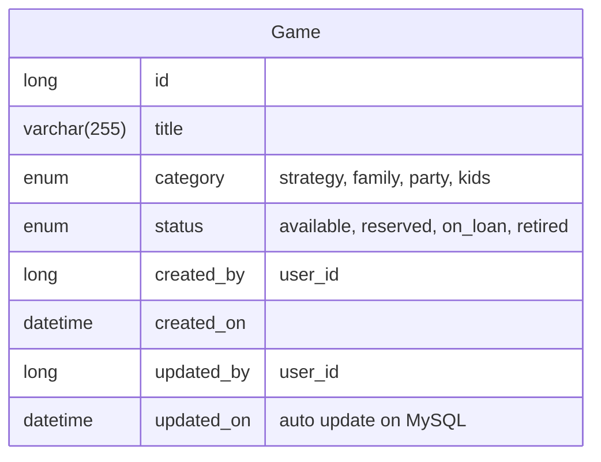

Arthur: W Cheng\
Development Environment: WSL - Ubuntu 24.04.4 LTS\
AI Assistant: Claude Code\
Tools: VsCode\
Setup Developlment Environment: Completed at 2026-07-21 15:04 BST\
GitHub token works.\

## Note

This README is the inital draft on how to progress on this task, will be trasnfer to `docs/inital thought` later in the repository.

## Inital Thought

Task: Develop a community board-game lending library.

Feature 1:  Create frontend page in `React`, allow browsing and filter the collection.

Feature 2: Create a button as `Add Collection`, create a form for adding a collection.

Feature 3: Allow transition of collection's `lifeCycle`

Feature 4: Special case of `lifeCycle`, `retired` (Retired mean **lost** or **damaged**). (When `Game` is retired, status no longer can be `available`.)

### Database Spec




## Initial Caution thought

1. Probably no login for now? There is no requirement for authencation yet, tho should left room for adding such function later.
2. Database using enum... is efficient, but will there be modification on `status` enum?
3. For feature 4, What does it mean a replacement copy can be linked to retired one ?? So that there is an additional table linking retired `Game`????

## Feature distribution

|progress|ticket|description|
|-|-|-|
|Completed|`feature/BGLL-01`|Create Laravel Base repository. Create Docker-compose base for Laravel and Mysql 8.4 (Laravel Sail default for PHP 8, decoupled API app in `backend/`)|
||`feature/BGLL-02`|Create Schema for `Games` in MySQL|
||`feature/BGLL-03`|Use Flyway to maintain database updates ... probably doesnt need? One-off task|
||`feature/BGLL-04`|Create ORM model in Laravel|
||`feature/BGLL-05`|Create API for CRUD of `Games` record|
|In-Progress|`feature/BGLL-06`|Create React base repository|
||`feature/BGLL-07`|Create Frontend Page|

## Running the full stack (demo)

There's a root-level `compose.yaml` that `include`s both `backend/compose.yaml` and `frontend/compose.yaml`, so the whole stack (Laravel + MySQL + React/Vite) can be started with one command from the repo root:

```bash
WWWUSER=$(id -u) WWWGROUP=$(id -g) docker compose --env-file backend/.env up --build
```

- The `WWWUSER`/`WWWGROUP` and `--env-file backend/.env` are needed because, unlike `./vendor/bin/sail up` (run from `backend/`), plain `docker compose` from the root doesn't auto-export those or auto-load `backend/.env`.
- Frontend: http://localhost:5175
- Backend: http://localhost

For day-to-day backend-only development, `./vendor/bin/sail up` from `backend/` still works as normal (see `backend/compose.yaml`) — just don't run both stacks at once, since they'd fight over the same ports (80, 3306, 5173).


