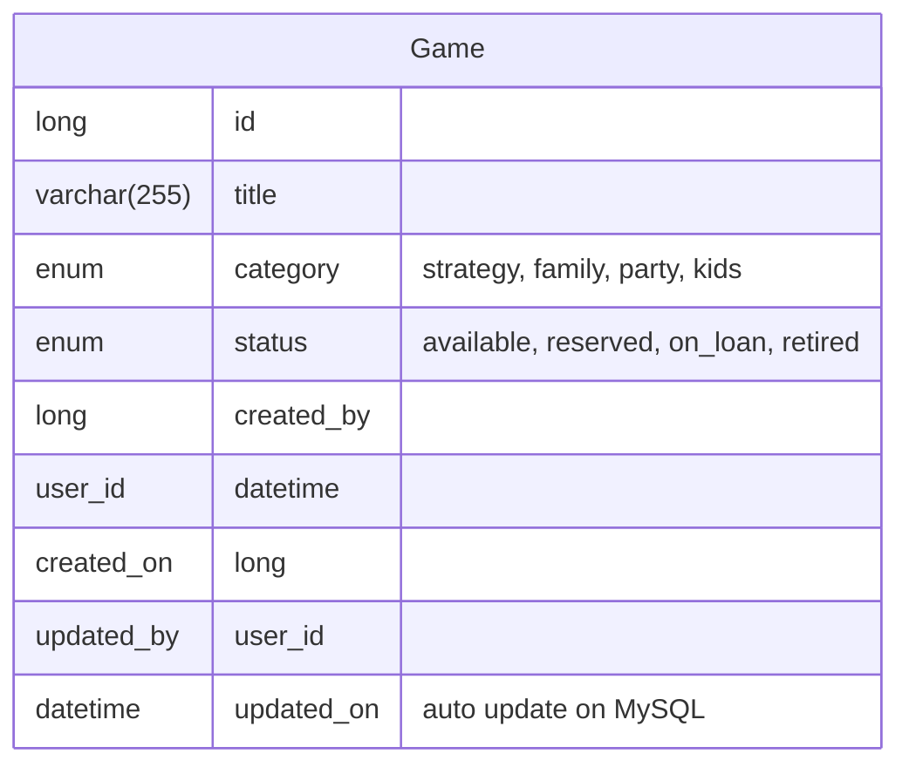

Arthur: W Cheng
Development Environment: WSL - Ubuntu 24.04.4 LTS
AI Assistant: Claude Code
Tools: VsCode
Setup Developlment Environment: Completed at 2026-07-21 15:04 BST

## Inital Thought

Task: Develop a community board-game lending library.

Feature 1:  Create frontend page in `React`, allow browsing and filter the collection.

Feature 2: Create a button as `Add Collection`, create a form for adding a collection.

Feature 3: Allow transition of collection's `lifeCycle`

Feature 4: Special case of `lifeCycle`, `retired`.

### Database Spec

## Initial Caution thought

1. Probably no login for now? There is no requirement for authencation yet, tho should left room for adding such function later.
2. Database using enum... is efficient, but will there be modification on `status` enum?

